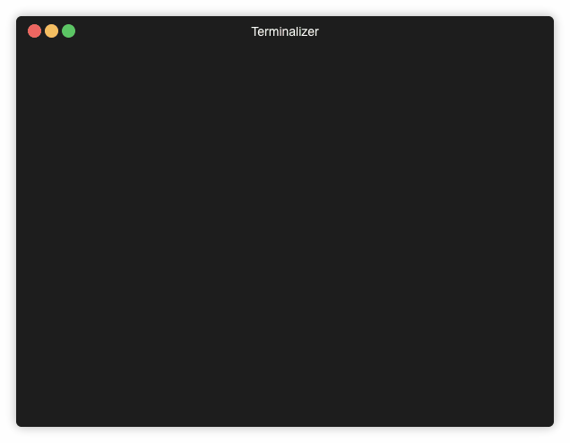

# Problem

Please write a simple program which takes a single number n from the user and in response displays n*n table, such that the content of cell (a,b) is a sum of a-th and b-th prime number. So for example for input `3` the output should read:

```
4 5  7
5 6  8
7 8  10
```

You can use any library available except for prime number generation. The solution should be hosted as public repository on github. Please remember about the tests, and best industry practices.

# Solution

The solution in implemented in Python 3. 

For creating a virtual environment 

- Use ``python3 -m venv myenv`` 
- Or `` virtualenv venv `` if your default python is version 3.x

 
# Run code

Simply use  ``python3 primes.py`` or ``python primes.py`` if your default python is 3.x 



