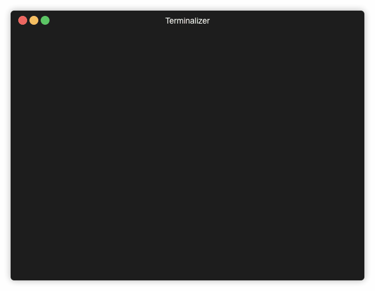

# Problem

One of the biggest challenges is adapting to requirement changes. Please change your program to do the following:

Allow user to define width and height of the matrix to build use non-square matrix.
Give user an option for a matrix cell values to use multiplication instead of addition (so instead of `<a-th prime> + <b-th prime>` be `<a-th prime> * <b-th prime>`
Give user an option to use Fibonacci numbers instead of prime numbers for matrix generation.

> Example program execution

=> Please give matrix dimension `(<width>x<height>)`:

-> 5x4

=> Should I use (P)rime numbers or (F)ibonacci numbers?

-> F

=> Multiplication (*) or Addition (+)

-> M

=> 1 1 2 3 5

=> 1 1 2 3 5

=> 2 2 4 6 10

=> 3 3 6 9 15

# Solution

### Create Virtual Environment

The solution in implemented in Python 3. 

For creating a virtual environment 

- Use ``python3 -m venv myenv`` 
- Or ``virtualenv myenv`` if your default python is version 3.x

 
### Run Program

Simply use ``python3 primes.py`` or ``python primes.py`` if your default python is 3.x

The program generates errors when input is not in correct format 

### Run Tests

Use  ``python3 tests.py``

